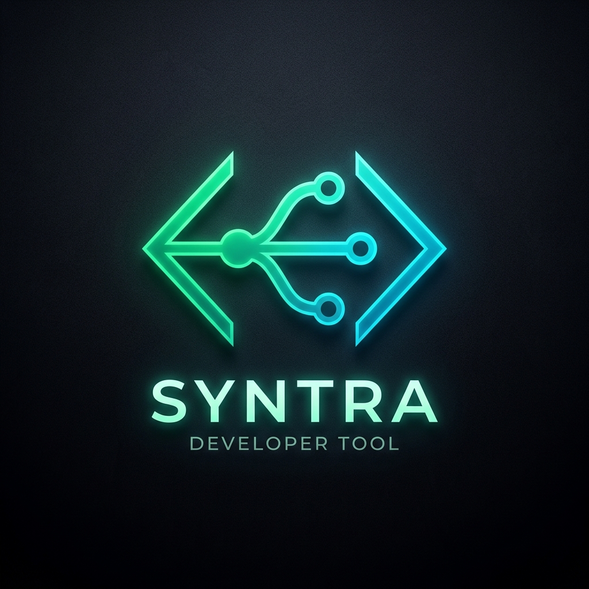

# ⚡ SYNTRA — LeetCode to GitHub Auto-Sync & DSA Tracker

<div align="center">



### **Automate your LeetCode solutions directly to GitHub and track your DSA journey.**


[Getting Started](#-getting-started) • [Features](#-key-features) • [Documentation](#-documentation) • [Environment Variables](#-environment-variables)

</div>

---

## 🌟 Key Features

- ⚡ **Automated GitHub Commits**: Every accepted LeetCode submission automatically generates `0001-two-sum/README.md` (Problem statement, runtime/memory stats) and `solution.cpp`/`.py`/`.js` inside your GitHub repository.
- 🔐 **1-Click GitHub OAuth & Cookie Sessions**: Log in effortlessly with 1-click **"Continue with GitHub"** or manual email/password auth saved in secure browser cookies.
- 📊 **LeetCode Profile Auto-Fetch**: Connect your LeetCode username to automatically fetch past solved problem counts & recent submissions via LeetCode's public GraphQL API.
- 🎯 **Curated DSA Roadmaps**: Built-in progress tracking for popular sheets: **Blind 75**, **NeetCode 150**, and **Striver's A2Z DSA Sheet**.
- 📝 **Notes & Revision Tagger**: Add intuition, time/space complexity notes, and bookmark tricky questions for 1-click revision before interviews.
- 🧩 **Chrome Extension Manifest V3**: Injected content script running on `leetcode.com/problems/*` detecting green "Accepted" submissions in real time.

---

## 📁 Repository Structure

```
leetcode_to_github/
├── docs/                       # Implementation & Setup Documentation
│   ├── SUPABASE_SETUP.md      # PostgreSQL tables script & Supabase Auth guide
│   ├── OAUTH_SETUP.md         # 1-Click GitHub OAuth setup guide
│   └── ARCHITECTURE.md        # System architecture & API documentation
├── extension/                  # Chrome Extension Manifest V3
│   ├── manifest.json
│   ├── content.js              # Intercepts LeetCode submissions
│   ├── background.js           # Pushes code to GitHub REST API
│   ├── popup.html / popup.js   # Extension settings & PAT setup
│   └── icons/
├── src/
│   ├── app/                    # Next.js 14 App Router & API routes
│   │   ├── api/
│   │   │   ├── auth/           # GitHub OAuth, PAT & login routes
│   │   │   ├── github/         # GitHub REST commit API route
│   │   │   └── leetcode/       # GraphQL auto-fetch route
│   │   ├── globals.css
│   │   ├── layout.tsx
│   │   └── page.tsx            # Main router (Landing Page vs Dashboard)
│   ├── components/             # React UI Components
│   │   ├── LandingPage.tsx
│   │   ├── Navbar.tsx
│   │   ├── DashboardStats.tsx
│   │   ├── ProblemList.tsx
│   │   ├── RoadmapSheetView.tsx
│   │   ├── AuthModal.tsx
│   │   └── LeetCodeLinkModal.tsx
│   ├── lib/                    # Supabase, Auth Cookies, GitHub & LeetCode helpers
│   └── types/                  # TypeScript interfaces
├── .env.example                # Sample environment variables
├── .env.local                  # Local environment file
├── package.json
└── README.md
```

---

## 🚀 Getting Started

### 1. Clone & Install Dependencies

```bash
git clone https://github.com/your-username/syntra.git
cd leetcode_to_github
npm install
```

### 2. Configure Environment Variables

Create `.env.local` or copy `.env.example`:

```bash
cp .env.example .env.local
```

Fill in your configuration:

```env
NEXT_PUBLIC_SUPABASE_URL=https://your-project.supabase.co
NEXT_PUBLIC_SUPABASE_ANON_KEY=your-supabase-anon-key
GITHUB_CLIENT_ID=your-github-client-id
GITHUB_CLIENT_SECRET=your-github-client-secret
JWT_SECRET=syntra_super_secret_jwt_key_2026
```

### 3. Run Next.js Development Server

```bash
npm run dev
```

Open [http://localhost:3000](http://localhost:3000) in your browser!

---

## 🧩 Chrome Extension Installation

1. Open Chrome and navigate to `chrome://extensions`.
2. Enable **Developer mode** toggle in the top-right corner.
3. Click **Load unpacked** and select the extension directory:  
   `D:\react\rudra\leetcode_to_github\extension`
4. Click the extension icon in Chrome toolbar to set your GitHub token & target repo name!

---

## 📚 Documentation

For complete step-by-step guides, refer to the `docs/` folder:

- 🗄️ [Supabase Database & RLS Setup Guide](docs/SUPABASE_SETUP.md)
- 🔑 [GitHub OAuth Registration Guide](docs/OAUTH_SETUP.md)
- 🏗️ [Full System & Extension Architecture](docs/ARCHITECTURE.md)

---

## 📄 License

Distributed under the MIT License. Built for developers mastering DSA & coding interviews!
