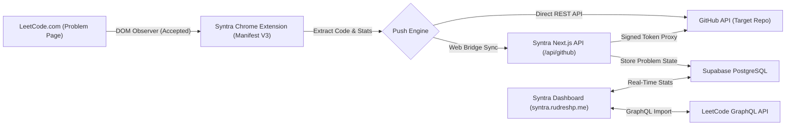

# SYNTRA — Automated LeetCode to GitHub Sync & DSA Tracker

<div align="center">


### **Turn your LeetCode problem solving into a clean, green GitHub portfolio.**

[](https://syntra.rudreshp.me/)
[](https://github.com/rudresh05/syntra)
[](LICENSE)

[](https://nextjs.org/)
[](https://www.typescriptlang.org/)
[](https://tailwindcss.com/)
[](https://supabase.com/)
[](https://developer.chrome.com/docs/extensions/mv3/)

[Live Demo](https://syntra.rudreshp.me/) • [Key Features](#key-features) • [System Architecture](#system-architecture) • [Chrome Extension](#chrome-extension-setup) • [Local Development](#local-development) • [Production Deployment](#production-deployment) • [Tech Stack](#tech-stack)

</div>

---

## Overview

**Syntra** is an automated Data Structures and Algorithms (DSA) preparation platform. It pairs a **zero-latency Chrome Extension (Manifest V3)** with a **Next.js 14 & Supabase web dashboard** to automatically commit accepted LeetCode solutions directly to your target GitHub repository in real time.

No manual copy-pasting. No messy commit histories. Every accepted solution is formatted into clean, idiomatic code with execution percentiles (Runtime & Memory), comprehensive problem statements, and tags.

---

## Key Features

### Chrome Extension Engine (Manifest V3)
- **Real-Time DOM Mutation Observer**: Intercepts the green "Accepted" submission verdict on `leetcode.com` within milliseconds.
- **Smart Duplicate Prevention**: Maintains a synchronized hash registry so identical submissions aren't pushed repeatedly.
- **Automated Directory & README Formatting**: Generates clean folders like `#0001-two-sum/` containing `Solution.java` (or C++, Python, TS) and a rich `README.md` with difficulty badges, execution stats, and problem descriptions.
- **GitHub SHA Conflict Resolution**: Automatically fetches the latest branch tree SHA before updating existing files, eliminating 409/422 conflicts.

### Java-First Multi-Language Code Generation
- Tailored for core engineering interviews with **Java 21** as the primary default.
- Full multi-language syntax detection and formatting for **C++20**, **Python 3**, **TypeScript**, and **Go**.

### Curated Roadmap Sheets
- Built-in tracking for top DSA curricula:
  - **Striver's A2Z DSA Sheet**
  - **NeetCode 150**
  - **Blind 75**
  - **Love Babbar 450**
- Track progress by topic (Arrays, Two Pointers, Dynamic Programming, Graphs, Trees, etc.).

### Live Developer Profile & Portfolio
- **Hero Identity Card**: High-definition avatar, verified PRO badge, real bio, location, company, and follower counters fetched directly from GitHub.
- **Performance Breakdown**: Visual progress bars across **Easy**, **Medium**, and **Hard** problems.
- **Synchronized Solutions Portfolio**: Searchable, filterable catalog of all synced DSA solutions with direct deep links to LeetCode and full code inspection modals.

### Spotlight Command Palette (Cmd+K / Ctrl+K)
- Instant keyboard navigation across problems, sheets, profile, settings, and external links.

### Server-Side Token Isolation
- **Zero Client-Side Token Exposure**: GitHub Personal Access Tokens and OAuth secrets are managed exclusively through secure server-side API proxies.
- **Cryptographically Signed Sessions**: 1-click **"Continue with GitHub"** OAuth flow with server-side cookie authentication.

---

## System Architecture



---

## Project Structure

```
leetcode_to_github/
├── docs/                           # Architecture & Setup Documentation
│   ├── ARCHITECTURE.md             # Detailed engineering design
│   ├── OAUTH_SETUP.md              # Step-by-step GitHub OAuth guide
│   ├── SUPABASE_SETUP.md           # Database tables & RLS policies
│   └── schema.sql                  # PostgreSQL database initialization
├── extension/                      # Chrome Extension (Manifest V3)
│   ├── manifest.json               # Manifest configuration
│   ├── config.js                   # Extension endpoints & constants
│   ├── background.js               # Service worker & GitHub REST push engine
│   ├── content.js                  # DOM mutation observer on leetcode.com
│   ├── popup.html / popup.js       # Extension UI popup & status checker
│   ├── web-bridge.js               # Seamless bridge between web app & extension
│   └── icons/                      # Extension icons (16px, 48px, 128px)
├── public/                         # Public assets (Logos, favicons, branding)
├── src/
│   ├── app/                        # Next.js 14 App Router
│   │   ├── api/
│   │   │   ├── auth/               # GitHub OAuth, PAT, login/register, session APIs
│   │   │   ├── github/             # GitHub commit & profile REST proxy
│   │   │   └── leetcode/           # LeetCode GraphQL fetch endpoints
│   │   ├── globals.css             # Tailwind CSS & specular glass styling
│   │   ├── layout.tsx              # Root HTML layout & fonts
│   │   └── page.tsx                # Dynamic SPA router (Landing vs Dashboard vs Profile)
│   ├── components/                 # Specular Glassmorphism UI Components
│   │   ├── UserProfileView.tsx     # Developer profile & solutions portfolio
│   │   ├── Navbar.tsx              # Segmented navigation & mobile bottom dock
│   │   ├── DashboardStats.tsx      # Metrics, streaks, and LeetCode counters
│   │   ├── ProblemList.tsx         # DSA question bank with filter/search
│   │   ├── RoadmapSheetView.tsx    # Curated sheets (Striver, NeetCode, Blind 75)
│   │   ├── CommandPaletteModal.tsx # Cmd+K Spotlight search modal
│   │   ├── GitHubSettingsModal.tsx # Target repo & branch configuration
│   │   ├── LeetCodeLinkModal.tsx   # LeetCode username connection modal
│   │   ├── LandingPage.tsx         # Modern specular landing page
│   │   └── AuthModal.tsx           # Authentication modal (OAuth & Email)
│   ├── config/                     # Centralized API endpoints & URLs
│   ├── data/                       # Curated DSA problem dataset (450+ questions)
│   ├── lib/                        # Auth, Supabase, GitHub & LeetCode utilities
│   └── types/                      # TypeScript definitions (Problem, Config, User)
├── .env.example                    # Environment variable template
├── package.json                    # Project dependencies & scripts
├── tailwind.config.ts              # Tailwind CSS configuration
├── tsconfig.json                   # TypeScript configuration
└── README.md
```

---

## Local Development

### 1. Prerequisites
- **Node.js**: `v18.17.0` or higher
- **npm** or **pnpm**
- **Git**

### 2. Clone the Repository
```bash
git clone https://github.com/rudresh05/syntra.git
cd syntra
```

### 3. Install Dependencies
```bash
npm install
```

### 4. Configure Environment Variables
Copy `.env.example` to `.env.local`:
```bash
cp .env.example .env.local
```

Fill in your configuration:
```env
# Supabase Configuration
NEXT_PUBLIC_SUPABASE_URL=https://your-project-ref.supabase.co
NEXT_PUBLIC_SUPABASE_ANON_KEY=your_supabase_anon_publishable_key
SUPABASE_SERVICE_ROLE_KEY=your_supabase_service_role_secret_key

# GitHub OAuth
GITHUB_CLIENT_ID=your_github_oauth_client_id
GITHUB_CLIENT_SECRET=your_github_oauth_client_secret

# Session & App URL
JWT_SECRET=your_super_secret_jwt_encryption_key_32_chars
NEXT_PUBLIC_APP_URL=http://localhost:3000
```

### 5. Start Development Server
```bash
npm run dev
```
Open **[http://localhost:3000](http://localhost:3000)** in your browser.

---

## Chrome Extension Setup

1. Open Google Chrome and navigate to `chrome://extensions`.
2. Toggle **Developer mode** on (top right corner).
3. Click **Load unpacked** (top left).
4. Select the `extension/` folder from this repository:
   ```
   path/to/syntra/extension
   ```
5. Pin the **Syntra** extension to your browser toolbar.
6. Open [syntra.rudreshp.me](https://syntra.rudreshp.me) (or your local instance) and connect your GitHub repository. The extension will automatically synchronize your credentials.

---

## Production Deployment (Vercel)

1. Push your code to GitHub.
2. Go to **[vercel.com](https://vercel.com)** and import your repository (`rudresh05/syntra`).
3. Under **Environment Variables**, add:
   - `NEXT_PUBLIC_APP_URL` = `https://syntra.rudreshp.me`
   - `NEXT_PUBLIC_SUPABASE_URL` = *(Your Supabase URL)*
   - `NEXT_PUBLIC_SUPABASE_ANON_KEY` = *(Your Supabase Anon Key)*
   - `SUPABASE_SERVICE_ROLE_KEY` = *(Your Supabase Service Role Key)*
   - `GITHUB_CLIENT_ID` = *(Your GitHub OAuth Client ID)*
   - `GITHUB_CLIENT_SECRET` = *(Your GitHub OAuth Secret)*
   - `JWT_SECRET` = *(Your JWT encryption secret)*
4. Click **Deploy**.
5. In **Settings > Domains**, add your custom domain: `syntra.rudreshp.me`.

> [!IMPORTANT]
> Make sure to update your GitHub OAuth App in **[GitHub Developer Settings](https://github.com/settings/developers)**:
> - **Homepage URL**: `https://syntra.rudreshp.me`
> - **Authorization callback URL**: `https://syntra.rudreshp.me/api/auth/github-callback`

---

## Tech Stack

| Layer | Technology |
| :--- | :--- |
| **Framework** | [Next.js 14](https://nextjs.org/) (App Router, Server Actions, Route Handlers) |
| **Language** | [TypeScript 5.6](https://www.typescriptlang.org/) (Strict Mode) |
| **Styling** | [Tailwind CSS 3.4](https://tailwindcss.com/) + Custom Specular Glassmorphism |
| **Database & Auth** | [Supabase](https://supabase.com/) (PostgreSQL with Row Level Security) |
| **Extension** | Google Chrome Extension Manifest V3 (DOM Mutation Observer) |
| **Vector Icons** | [Lucide React](https://lucide.dev/) (Pure SVG) |
| **APIs** | GitHub REST API v3, LeetCode Public GraphQL API |
| **Hosting** | [Vercel](https://vercel.com/) |

---

## License

Distributed under the **MIT License**. See `LICENSE` for more information.

---

<div align="center">

Developed by [Rudresh Patel](https://github.com/rudresh05) for engineers mastering data structures and algorithms.

</div>
